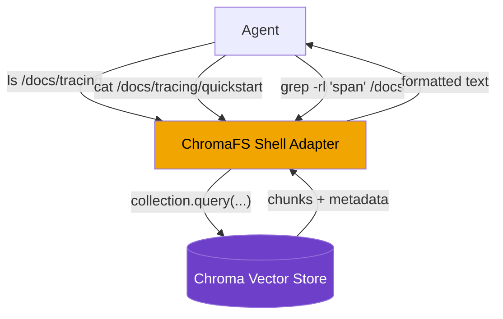
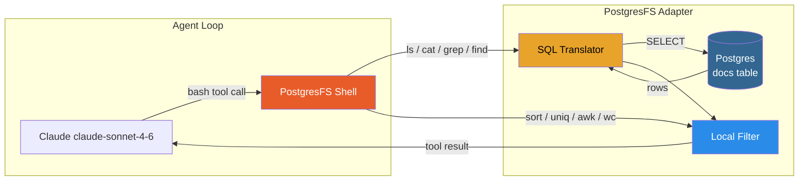
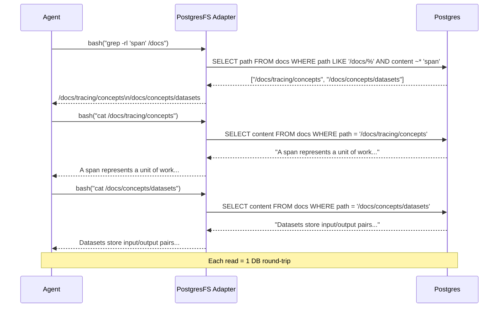
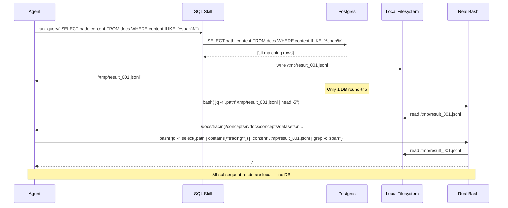
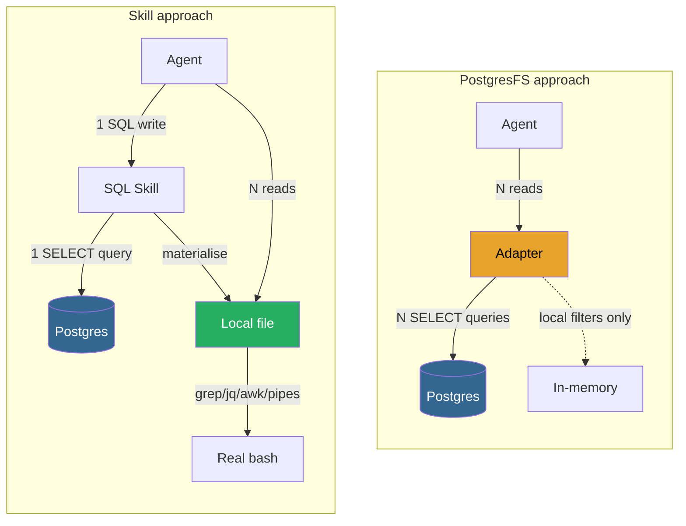
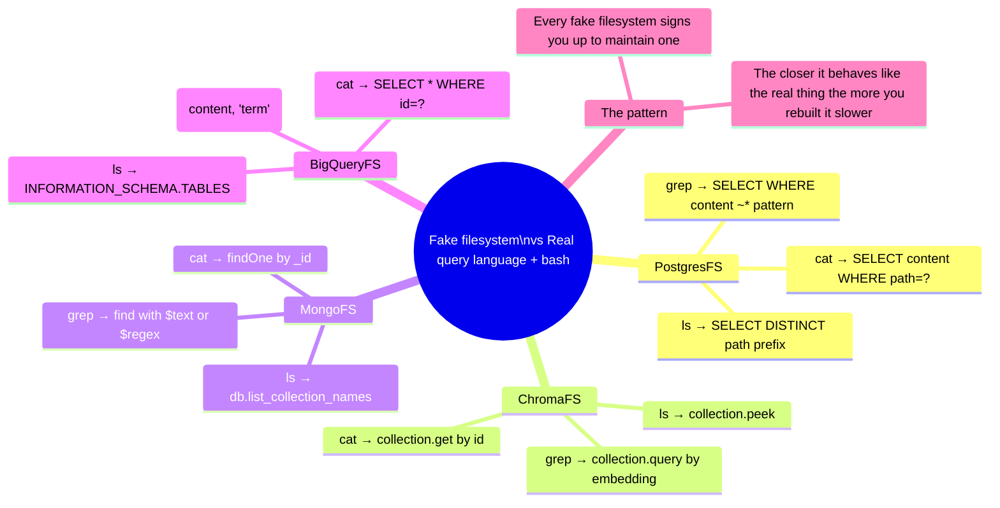

# PostgresFS vs ChromaFS vs the SQL Skill — A Deep Dive

> Based on the Arize AI article *"Faking a Filesystem For your Agent: PostgresFS"* by Aparna Dhinakaran & Sufjan Fan.

---

## 1. The Pattern That Started It All: ChromaFS

Mintlify built **ChromaFS** to make their documentation assistant smarter. Plain vector RAG had a hard ceiling: it could only return chunks that matched a query embedding. If an answer spanned several pages, or needed exact syntax that never landed in the top-K results, the agent was stuck.

Their solution: wrap the Chroma vector store in a **filesystem-shaped interface**. The agent runs `ls`, `cat`, `grep`, `find` — and underneath every command is a database read.



**Why it felt clever:** Agents are trained on vast amounts of shell/terminal data. Giving them a familiar surface (Unix commands) meant they could immediately apply known patterns — `grep` to search, `ls` to explore, `cat` to read — without learning new tool APIs.

---

## 2. PostgresFS — The Same Pattern Over SQL

Arize AI replicated the pattern over Postgres to benchmark it properly. **PostgresFS** exposes the same five ChromaFS verbs over a relational docs table:

| Shell command | SQL translation |
|---|---|
| `ls /docs/tracing` | `SELECT DISTINCT split_part(path, '/', ...) FROM docs WHERE path LIKE '/docs/tracing/%'` |
| `cat /docs/tracing/quickstart` | `SELECT content FROM docs WHERE path = '/docs/tracing/quickstart'` |
| `grep -r 'span' /docs` | `SELECT path, content FROM docs WHERE path LIKE '/docs/%' AND content ~* 'span'` |
| `find /docs -name '*.md'` | `SELECT path FROM docs WHERE path LIKE '/docs/%' AND path LIKE '%.md'` |
| `cd /docs/tracing` | *(updates internal cwd state, no query)* |

Local coreutils filters (`sort`, `uniq`, `wc`, `awk`, `sed`, `cut`, `tr`, `head`, `tail`, `comm`) run **in-process** over bytes already in memory — no extra round-trip to the database.

### Architecture



### The read path in detail

Every `cat` or `grep` command takes this path:



---

## 3. The Skill — One Round-Trip, Then Real Bash

The competing approach skips the abstraction entirely. The agent gets:
- **`run_query(sql)`** — executes SQL and writes results to a local `.jsonl` file, returns the path
- **Real `bash`** — the host's actual shell with full coreutils, pipes, process substitution, `/tmp`

The agent's job: write SQL broad enough to capture all candidates, materialize once, then compose locally.

```mermaid
graph LR
    subgraph Agent Loop
        A[Claude claude-sonnet-4-6] -->|run_query| SK[SQL Skill]
        A -->|bash| SH[Real Shell]
    end

    subgraph One DB Round-Trip
        SK -->|SQL query| DB[(Postgres\ndocs table)]
        DB -->|rows| SK
        SK -->|writes| F[/tmp/result_001.jsonl]
    end

    subgraph Local Composition
        SH -->|grep / jq / awk / sort / pipes| F
        F -->|stdout| SH
    end

    SH -->|tool result| A
    SK -->|file path| A

    style SK fill:#27ae60,color:#fff
    style SH fill:#2980b9,color:#fff
    style DB fill:#336791,color:#fff
    style F fill:#95a5a6,color:#000
```

### The read path in detail



---

## 4. Head-to-Head Comparison



### Key differences at a glance

| Property | PostgresFS | SQL Skill |
|---|---|---|
| DB round-trips per question | N (one per read) | 1 |
| Local composition tools | Subset (no `/tmp`, no `<(...)`) | Full bash |
| Second-pass possible? | No (read-only, EROFS) | Yes |
| `comm`, `join`, `diff` work? | Defined but dead | Yes |
| Maintenance burden | High (adapter + cache + translator) | Low (prompt + script) |
| Agent learning curve | Familiar shell verbs | New `run_query` tool |

---

## 5. Where Each Approach Wins and Loses

<svg xmlns="http://www.w3.org/2000/svg" viewBox="0 0 760 400" font-family="'Segoe UI', system-ui, sans-serif">
  <!-- Background -->
  <rect width="760" height="400" fill="#0d1117" rx="12"/>

  <!-- Title -->
  <text x="380" y="36" text-anchor="middle" fill="#e6edf3" font-size="16" font-weight="600">Benchmark Results — 10 Questions × 10 Runs (Median)</text>

  <!-- Legend -->
  <rect x="490" y="52" width="14" height="14" rx="3" fill="#e8a42a"/>
  <text x="509" y="63" fill="#8b949e" font-size="12">PostgresFS</text>
  <rect x="580" y="52" width="14" height="14" rx="3" fill="#27ae60"/>
  <text x="599" y="63" fill="#8b949e" font-size="12">Skill</text>

  <!-- Y-axis label -->
  <text x="16" y="240" fill="#8b949e" font-size="11" transform="rotate(-90 16 240)" text-anchor="middle">Accuracy (/ 10)</text>

  <!-- Grid lines -->
  <line x1="80" y1="70" x2="720" y2="70" stroke="#21262d" stroke-width="1"/>
  <line x1="80" y1="130" x2="720" y2="130" stroke="#21262d" stroke-width="1"/>
  <line x1="80" y1="190" x2="720" y2="190" stroke="#21262d" stroke-width="1"/>
  <line x1="80" y1="250" x2="720" y2="250" stroke="#21262d" stroke-width="1"/>
  <line x1="80" y1="310" x2="720" y2="310" stroke="#21262d" stroke-width="1"/>

  <!-- Y-axis labels -->
  <text x="74" y="74" text-anchor="end" fill="#8b949e" font-size="11">10</text>
  <text x="74" y="134" text-anchor="end" fill="#8b949e" font-size="11">8</text>
  <text x="74" y="194" text-anchor="end" fill="#8b949e" font-size="11">6</text>
  <text x="74" y="254" text-anchor="end" fill="#8b949e" font-size="11">4</text>
  <text x="74" y="314" text-anchor="end" fill="#8b949e" font-size="11">2</text>

  <!-- X-axis baseline -->
  <line x1="80" y1="310" x2="720" y2="310" stroke="#30363d" stroke-width="1.5"/>

  <!-- Bar groups: q1-q10, spacing=64px, bar width=20px each, gap=4 -->
  <!-- q1: PFS=10, SK=10 -->
  <rect x="89" y="70" width="20" height="240" fill="#e8a42a" rx="2" opacity="0.9"/>
  <rect x="113" y="70" width="20" height="240" fill="#27ae60" rx="2" opacity="0.9"/>
  <text x="111" y="328" text-anchor="middle" fill="#8b949e" font-size="11">q1</text>

  <!-- q2: PFS=10, SK=10 -->
  <rect x="153" y="70" width="20" height="240" fill="#e8a42a" rx="2" opacity="0.9"/>
  <rect x="177" y="70" width="20" height="240" fill="#27ae60" rx="2" opacity="0.9"/>
  <text x="175" y="328" text-anchor="middle" fill="#8b949e" font-size="11">q2</text>

  <!-- q3: PFS=10, SK=10 -->
  <rect x="217" y="70" width="20" height="240" fill="#e8a42a" rx="2" opacity="0.9"/>
  <rect x="241" y="70" width="20" height="240" fill="#27ae60" rx="2" opacity="0.9"/>
  <text x="239" y="328" text-anchor="middle" fill="#8b949e" font-size="11">q3</text>

  <!-- q4: PFS=7, SK=10 → heights 168, 240 -->
  <rect x="281" y="142" width="20" height="168" fill="#e8a42a" rx="2" opacity="0.9"/>
  <rect x="305" y="70" width="20" height="240" fill="#27ae60" rx="2" opacity="0.9"/>
  <text x="303" y="328" text-anchor="middle" fill="#8b949e" font-size="11">q4</text>

  <!-- q5: PFS=10, SK=10 -->
  <rect x="345" y="70" width="20" height="240" fill="#e8a42a" rx="2" opacity="0.9"/>
  <rect x="369" y="70" width="20" height="240" fill="#27ae60" rx="2" opacity="0.9"/>
  <text x="367" y="328" text-anchor="middle" fill="#8b949e" font-size="11">q5</text>

  <!-- q6: PFS=10, SK=10 -->
  <rect x="409" y="70" width="20" height="240" fill="#e8a42a" rx="2" opacity="0.9"/>
  <rect x="433" y="70" width="20" height="240" fill="#27ae60" rx="2" opacity="0.9"/>
  <text x="431" y="328" text-anchor="middle" fill="#8b949e" font-size="11">q6</text>

  <!-- q7: PFS=6, SK=10 → heights 144, 240 -->
  <rect x="473" y="166" width="20" height="144" fill="#e8a42a" rx="2" opacity="0.9"/>
  <rect x="497" y="70" width="20" height="240" fill="#27ae60" rx="2" opacity="0.9"/>
  <text x="495" y="328" text-anchor="middle" fill="#8b949e" font-size="11">q7</text>

  <!-- q8: PFS=9, SK=10 → heights 216, 240 -->
  <rect x="537" y="94" width="20" height="216" fill="#e8a42a" rx="2" opacity="0.9"/>
  <rect x="561" y="70" width="20" height="240" fill="#27ae60" rx="2" opacity="0.9"/>
  <text x="559" y="328" text-anchor="middle" fill="#8b949e" font-size="11">q8</text>

  <!-- q9: PFS=9, SK=10 -->
  <rect x="601" y="94" width="20" height="216" fill="#e8a42a" rx="2" opacity="0.9"/>
  <rect x="625" y="70" width="20" height="240" fill="#27ae60" rx="2" opacity="0.9"/>
  <text x="623" y="328" text-anchor="middle" fill="#8b949e" font-size="11">q9</text>

  <!-- q10: PFS=9, SK=10 -->
  <rect x="665" y="94" width="20" height="216" fill="#e8a42a" rx="2" opacity="0.9"/>
  <rect x="689" y="70" width="20" height="240" fill="#27ae60" rx="2" opacity="0.9"/>
  <text x="687" y="328" text-anchor="middle" fill="#8b949e" font-size="11">q10</text>

  <!-- Tier labels -->
  <rect x="89" y="345" width="162" height="22" rx="4" fill="#21262d"/>
  <text x="170" y="360" text-anchor="middle" fill="#8b949e" font-size="11">Simple (q1–q3)</text>
  <rect x="265" y="345" width="226" height="22" rx="4" fill="#21262d"/>
  <text x="378" y="360" text-anchor="middle" fill="#8b949e" font-size="11">Mid (q4–q6)</text>
  <rect x="505" y="345" width="210" height="22" rx="4" fill="#21262d"/>
  <text x="610" y="360" text-anchor="middle" fill="#8b949e" font-size="11">Complex (q7–q10)</text>

  <!-- Overall score callouts -->
  <text x="380" y="390" text-anchor="middle" fill="#6e7681" font-size="11">PostgresFS total: 93/100 · Skill total: 99/100 · Gap driven entirely by q4 and q7</text>
</svg>

### Why the gap is two specific questions

The failures are not random. Both losers are PostgresFS, both are in the mid/complex tier, and both require **multi-pass reads**:

- **q4 (counting)** — the agent needs to count documents matching a pattern. PostgresFS pays one round-trip per candidate file it reads to verify. The skill runs one `COUNT(*)` query.
- **q7 (synthesis)** — the agent needs to read multiple documents, stage intermediate notes, and synthesize. PostgresFS has no `/tmp` and no process substitution, so staging is impossible. The skill writes once and composes freely.

---

## 6. The Composability Wall

The most important property isn't speed — it's **whether the agent owns a local copy of the data**.

```mermaid
graph TD
    subgraph "Operations that work on both"
        W1[Single-pass pipeline\ne.g. grep -c 'span' output]
        W2[Simple filter chain\ne.g. ls | sort | head -5]
    end

    subgraph "Operations that ONLY work with the Skill"
        S1["Second-pass over same data\ne.g. first grep, then awk on results"]
        S2["Process substitution\ne.g. comm <(list_a) <(list_b)"]
        S3["Stage intermediate results\ne.g. write to /tmp, read later"]
        S4["Two-input operators\ne.g. join, diff, paste"]
    end

    PostgresFS -->|supports| W1
    PostgresFS -->|supports| W2
    PostgresFS -.-x|EROFS — no writes| S1
    PostgresFS -.-x|no <(...) support| S2
    PostgresFS -.-x|no /tmp| S3
    PostgresFS -.-x|dead — no staging| S4

    Skill -->|supports| W1
    Skill -->|supports| W2
    Skill -->|supports| S1
    Skill -->|supports| S2
    Skill -->|supports| S3
    Skill -->|supports| S4

    style PostgresFS fill:#e8a42a,color:#000
    style Skill fill:#27ae60,color:#fff
    style S1 fill:#1c2128,color:#e6edf3
    style S2 fill:#1c2128,color:#e6edf3
    style S3 fill:#1c2128,color:#e6edf3
    style S4 fill:#1c2128,color:#e6edf3
```

---

## 7. The Maintenance Trap

Every step toward making PostgresFS more faithful is a step toward rebuilding a real filesystem — at greater maintenance cost.

```mermaid
graph LR
    A[Basic PostgresFS\nls/cat/grep/find] -->|"add prefetch"| B[PostgresFS + Cache]
    B -->|"fix grep semantics"| C[PostgresFS + Regex Translator]
    C -->|"add write support"| D[PostgresFS + /tmp shim]
    D -->|"add process substitution"| E[PostgresFS ≈ Real Filesystem]

    E -.->|"what you actually wanted"| F[Real files\n+ SQL skill\n= just the skill]

    style A fill:#e8a42a,color:#000
    style B fill:#e07a1a,color:#fff
    style C fill:#d45e0a,color:#fff
    style D fill:#b84000,color:#fff
    style E fill:#8b0000,color:#fff
    style F fill:#27ae60,color:#fff
```



Each step increases the custom layer you must maintain. The closer you get to a real filesystem, the more you've just rebuilt one — slower and with more bugs.

---

## 8. Generalises Beyond Postgres

The same decision applies to every backing store an agent might query:



---

## 9. The Takeaway

> **"What does the host shell actually read from?"** beats **"what shape would I like to expose?"**

The rule of thumb:

1. **Use the database for what it's good at** — broad retrieval, filtering at TB scale, aggregation.
2. **Materialise once** — one query, one local file.
3. **Compose locally** — the host shell is broader, faster, and already correct.
4. **Don't fake a filesystem** — you'll spend months maintaining an adapter that's always worse than the real thing.

---

## 10. This Repo

| Directory | What it does |
|---|---|
| `postgresfs/` | Full PostgresFS adapter (ls/cat/grep/find/cd → SQL, local filters) |
| `skill/` | SQL skill (one query → local `.jsonl`, real bash after) |
| `agent/` | Claude SDK agent loops for both arms |
| `eval/` | 10 benchmark questions, LLM judge, results runner |
| `scripts/` | DB seeder with sample docs |

Run the benchmark:

```bash
pip install -e .
cp .env.example .env          # fill ANTHROPIC_API_KEY + POSTGRES_DSN
python scripts/seed_db.py --dsn "$POSTGRES_DSN"
python -m eval.run_eval --dsn "$POSTGRES_DSN" --runs 10
```
